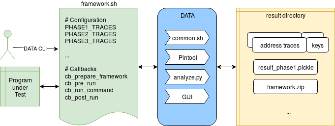

# Usage

## Directory Structure

|                         Folder                           |                             Description                                     |
| -------------------------------------------------------- |-----------------------------------------------------------------------------|
| [papers](./papers)                                       | Scripts and instructions to reproduce results from published papers         |
| [cryptolib](./cryptolib)                                 | Crypto frameworks (programs under test)                                     |
| &ensp;&#8627;[common](./cryptolib/common)                | Shared DATA files that coordinate all phases of DATA                        |
| [data-gui](https://github.com/IAIK/data-gui)             | Graphical user interface (GUI) as git submodule                             |
| [pin](./pin)                                             | Root directory of the Intel Pin DBI framework                               |
| [pintool](./pintool)                                     | DATA's Pintool extension to generate address traces                         |
| [analysis](./analysis)                                   | DATA's Python analysis scripts                                              |
| &ensp;&#8627;[leakage_models](./analysis/leakage_models) | Input transformations (leakage models) for leakage classification (phase 3) |

## Prerequisites

DATA should run at least on the following 64-bit x86 Linux systems:

* Ubuntu 19.04
* Ubuntu 18.10
* Ubuntu 16.04
* Debian 9.8
* Debian 9.4
* Debian 8.3

Tested python versions:

* Python 3.7
* Python 3.5

DATA needs `setarch` in order to disable ASLR. Since Docker has issues
with `setarch`, DATA cannot be run inside Docker.

## Install

On Debian/Ubuntu, the following packages are required to run DATA:

```
sudo apt-get install coreutils util-linux bash sed grep wget tar mawk time build-essential git python3 python3-setuptools python3-dev python3-virtualenv gcc-multilib
```

Build and install DATA by executing

```
make
make install
```

This creates a file `data.sh` in your HOME directory which needs to
be sourced in order to activate DATA.

### Setuptools Error
If you encounter a compile-time error related to setuptools, setting the following environment variable can help:
```bash
export SETUPTOOLS_USE_DISTUTILS=stdlib
```

## Uninstall

1. Delete the DATA_ROOT directory listed in `~/data.sh`
2. Remove `data.sh` from your HOME directory via

```
rm ~/data.sh
```

## Getting started

To run DATA on an existing library framework, follow these steps:

1. Enable data
    * `source ~/data.sh`
2. Choose a crypto framework to analyze and navigate into its folder
    * `cd cryptolib/openssl`
3. Choose a result directory by setting the `RESULTDIR` variable
    * `export RESULTDIR=/tmp/DATA_results`
4. List available algorithms by invoking the framework script
    * `./symmetric.sh -l`
5. Choose an algorithm of the list, and analyze it
   * `./symmetric.sh --phase1 -p -e --gui des-ecb 64`

To test your own library, have a look at this
[template](cryptolib/template) and read the next sections.

## Using DATA



Usage of DATA requires several interacting components. The analyst
writes a framework script representing a program or library to test.
The framework script is invoked from the command line and in turn
invokes DATA. All results are collected in a single result directory.

### Framework scripts

DATA is centered around a so-called framework script responsible for
providing a wrapper for the program to test. It needs to provide a few
`bash` callback functions interfacing with the program to test. In
particular, the callback functions are responsible for:

* building the program to test into an executable file
* generating cryptographic keys or other necessary input files
* invoking the executable

Also, the framework script embeds DATA with an easy-to-use command-line
interface called DATA CLI.

### DATA CLI

DATA provides an easy-to-use command-line interface (CLI). The most
important flags are:

* `--phase1` Run the first phase and produce `result_phase1.pickle`
* `--phase2` Run the second phase produce `result_phase2.pickle`
* `--phase3` Run the third phase and produce `result_phase3.pickle`
* `-p`       Run the analysis on all available CPU cores in parallel
* `-e`       Export framework files for the DATA GUI
* `--gui`    Open the DATA GUI to visualize the latest analysis results
* `-h`       Print the help

#### Detailed Steps

1. **Preparation:**
    When invoking DATA CLI, it first compiles the library under test.
    To do so, it invokes the `cb_prepare_framework` callback specified
    in the framework script.

2. **Phase 1 key generation (`-g` flag): **
    DATA generates random cryptographic keys for later analysis.
    To do so, it invokes the `cb_genkey` callback specified in the
    framework script. In addition, the script specifies the number of
    generated keys via `PHASE1_TRACES`. Keys are named `.key` in the
    result directory.

3. **Phase 1 trace recording (`-d` flag):**
    DATA records *full-length* address traces with
    [Pintool](./pintool/addrtrace.cpp). To do so, it invokes the
    callbacks `cb_pre_run`, `cb_run_command` and `cb_post_run`
    specified in the framework script. Each execution of the program
    under test uses one of the previously generated keys. Traces are
    named `.trace` in the result directory.

4. **Phase 1 difference detection (`-ad` flag):**
    The DATA [analysis script](./analysis/analyze.py) compares the
    *full-length* address traces pairwise to find control-flow and data
    differences. If a program under test yields no differences, the
    analysis is stopped and phases 2 and 3 are skipped. If differences
    occur, the results are stored in `result_phase1.pickle`. In
    addition, all leaking code locations are stored in `leaks.bin` for
    phase 2 and 3.

5. **Phase 2 trace recording (`-ns` flag):**
    DATA records *reduced* address traces for one random-key set and
    multiple fixed-key sets with [Pintool](./pintool/addrtrace.cpp).
    For the random set, a random key is generated for each trace, as
    with phase 1. For the fixed sets, the program under test is
    executed repeatedly with the same secret input. `PHASE2_TRACES`
    specifies the number of traces per set. `PHASE2_CONSTKEYS`
    specifies the number of fixed-key sets. Thus, in total
    `(PHASE2_CONSTKEYS+1)*PHASE2_TRACES` traces are recorded. For every
    trace, the [Pintool](./pintool/addrtrace.cpp) only monitors the
    instructions and memory loads listed in `leaks.bin`. This
    significantly reduces the instrumentation time and the trace sizes.
    All traces and keys are stored in the `gen_*` sub-directories
    within the result directory.

6. **Phase 2 leakage detection (`-an` flag):**
    The DATA [analysis script](./analysis/analyze.py) iterates over all
    differences from phase 1 and compares the observed addresses in the
    fixed and random trace sets. If the addresses do not have a similar
    distribution in both sets, the corresponding difference is flagged
    as an information leak. The results are stored in
    `result_phase2.pickle` in the result directory.

7. **Phase 3 trace recording (`-sp` flag):**
    DATA records *reduced* address traces with
    [Pintool](./pintool/addrtrace.cpp), as with phase 2. The number of
    traces is specified via `PHASE3_TRACES`. To reduce computation
    time, traces and keys from phase 2 can be partially reused (`-u`
    flag). All traces and keys are stored in the `spe_*`
    sub-directories within the result directory.

8. **Phase 3 leakage classification (`-as` flag):**
    The DATA [analysis script](./analysis/analyze.py) iterates over all
    leaks from phase 2 (or from phase 1 if `PHASE3_SKIP_PHASE2` is set)
    and tests them against a leakage model specified via
    `SPECIFIC_LEAKAGE_CALLBACK`. Available leakage models are listed in
    [leakage models](./analysis/leakage_models). The results are stored
    in `result_phase3_<leakage-model>.pickle` in the result directory.

9. **Finalization (`-i` flag):**
    Depending on which previous phases were run, this option causes
    DATA to collect all results into a single `result_final.pickle`
    file. Moreover, as all statistical tests are already run, this
    option strips unneeded trace information from the pickle file.

10. **Framework export (`-e` flag):**
    This option compresses all necessary framework files needed for the
    DATA GUI into a single `framework.zip` archive. In particular, this
    archive contains disassembler dumps and source code (if available)
    of all code which exhibits phase one differences. Thus, the DATA
    GUI can be run on a different computer by giving it the
    `framework.zip` archive, alongisde the `.pickle` report to analyze.

11. **DATA GUI (`--gui` flag):**
    This option runs the DATA GUI directly from the DATA CLI on the
    last result pickle. It requires a framework export first.

## Graphical User Interface (GUI)

DATA comes with a standalone graphical user interface (GUI) to
visualize leakage results. You can launch the GUI either via the DATA
CLI, or by running `datagui` directly on the command line.

The GUI asks for the `result_*.pickle` as well as the exported
`framework.zip`, which are both in the result directory. For more
information about the GUI check out the
[README](https://github.com/IAIK/data-gui/blob/master/README.md).

## Usage Tips

The following sections contain usage recommendations that help improve
your experience with DATA.

### How To Start

* **Custom Wrappers:**
  Sometimes, the program under test does not ship as binary. In this
  case, you need to develop a custom wrapper invoking the program, e.g.
  parametrized via the command line. When developing such a custom
  wrapper, avoid leakage in your wrapper code.

* **Debug Compile:**
  Make sure to compile your program under test with debug information
  (gcc `-g` flag). DATA GUI will then be able to display source code,
  alongside discovered leakage.

* **Framework Script:**
  Have a look at this [template](cryptolib/template) as a starting
  point for your own framework script. DATA tries to reduce
  non-determinism by disabling ASLR and clearing all environment
  variables. If your program under test requires certain environment
  variables, write them into `${ENVFILE}` (see openssl/asymmetric.sh as
  example). Use the `--dry` flag to test your script with extended
  output.

* **Reduce Non-Determinism:**
  In your framework script or custom wrapper, it is recommended to set
  all non-secret or unrelated program inputs to fixed values. This
  reduces noise in the address traces of phase one and reveals leaks
  faster. If an input can't be fixed, DATA will filter out its effects
  in phase two and free. Simply record more traces in this case. The
  same holds for non-deterministic program behavior, which is for
  instance introduced by side-channel countermeasures that randomize
  code or data accesses. Any non-deterministic behavior with no
  relation to the secret will be filtered at the expense of increasing
  the number of traces.

### Analysis Speed-Up
The DATA CLI currently offers two options for improved analysis speed:

1. **Parallel execution (`-p` flag):**
    DATA performs various analysis steps in parallel via separate
    sub-processes. The number of sub-processes is limited by the number
    of processor cores available to the script. Make sure that
    sufficient system resources are available, as parallel execution
    might cause significant system load!

2. **Trace reuse (`-u` flag):**
    This option forces DATA to reuse all random traces from phase 2 for
    the third phase. If phase three still requires more traces, DATA
    will automatically record the missing traces.


### Number of Traces

The number of traces in each phase can be configured in the framework
script of each tested program via the following environment variables:

|   Variable         |                      Description                       |
|--------------------|--------------------------------------------------------|
| `PHASE1_TRACES`    | number of keys / traces to generate in phase 1         |
| `PHASE2_FIXEDKEYS` | number of phase 2 repetitions (fixed key sets)         |
| `PHASE2_TRACES`    | number of traces to generate per repetition in phase 2 |
| `PHASE3_TRACES`    | number of traces to generate in phase 3                |

Always make sure that `PHASE1_TRACES` is larger or equal than
`PHASE2_FIXEDKEYS`. Since it is not possible to provide reasonable
measurement numbers that hold for arbitrary programs under test, we
recommend to start with the default numbers that are pre-configured.
Increase `PHASE1_TRACES` as long as new differences appear. Once the
number of differences settles, increase `PHASE2_TRACES` as long as the
leakage statistics contain untested differences. Increase
`PHASE2_FIXEDKEYS` if there seem to be leaks among the dropped
differences. Finally, increase `PHASE3_TRACES` to reveal faint
relations in the specific leakage tests. Note that increasing
`NTRACE_DIFF` requires new measurements for phases 2 and 3, if the
additional traces in phase 1 reveal new differences.


## XML Analysis Reports

This section is only relevant for more advanced analysis. In addition
to the `.pickle` result files, the [analysis
script](./analysis/analyze.py) stores all results in readable XML
reports. They show where differences and leaks occur, and give more
details about generic and specific leakage tests than the DATA GUI. The
XML reports can be found in each analysis directory as:

* `result_phase1.xml`
* `result_phase2.xml`
* `result_phase3_<leakage-model>.xml`
* `result_final.xml`

All generated reports have the same basic structure:

```xml
<Report>
  <CallHierarchy>
    ...
  </CallHierarchy>
  <LibHierarchy>
    ...
  </LibHierarchy>
<Report>
```

#### CallHierarchy

The *CallHierarchy* lists differences and leaks according to the call
graph. Every function call in the execution creates a new *context* to
which differences and leaks can be attributed. The following is an
example of a function call during DES encryption in OpenSSL:

```xml
<context>
  CALL 7ffff6374872(+179872)[733]: PEM_read_bio(T)@/PATH/libcrypto.so.1.1
  TO 7ffff634c570(+151570)[250]: EVP_DecodeUpdate(T)@/PATH/libcrypto.so.1.1
</context>
```

The snippet reports that there was a call in `PEM_read_bio()` to
`EVP_DecodeUpdate()`. For each code location, the report prints a set
of properties:

|     Property              |                      Description                     |
|---------------------------|------------------------------------------------------|
| `7ffff6374872`            | absolute (virtual) address                           |
| `(+179872)`               | relative address offset in the binary                |
| `[733]`                   | symbol size, if known (otherwise `?` is printed)     |
| `PEM_read_bio`            | symbol name, if known (otherwise `?` is printed)     |
| `(T)`                     | symbol type, taken from `nm --defined-only <binary>` |
| `/PATH/libcrypto.so.1.1`  | the absolute binary path                             |

In the `<CallHierarchy>` element, control-flow and data differences or
leaks are always attributed to a context. They are printed before the
*return* of the call, which is indicated by `</context>`, as shown:

```xml
<context>
  CALL ...
  TO ...
  <dataleaks>
    ...
  </dataleaks>
  <cfleaks>
    ...
  </cfleaks>
</context>
```

Individual differences and leaks are each presented with a separate
entry. The following leak appears during DES encryption:

```xml
<dataleaks>
  <leak>
    7ffff62ea2e9(+1782e9)[1f]: OPENSSL_hexchar2int(T)@/PATH/libcrypto.so.1.1
    7ffff6391a60: 36
    7ffff6391a61: 48
    7ffff6391a62: 12
    ...
    <result status='leak' type='generic,specific'>
      <generic result='leak' source='H_pos' kuiper='0.866667' significance='0.438291' confidence='0.999900'/>
      <generic result='leak' source='H_addr' kuiper='0.192708' significance='0.112697' confidence='0.999900'/>
      ...
      <specific result='leak' source='M_pos' leakagemodel='sym_byte_value' property='2' address='7ffff6391a96' rdc='0.4166' significance='0.4123' confidence='0.999900'/>
      <specific result='leak' source='M_addr' leakagemodel='sym_byte_value' property='2' address='7ffff6391a96' rdc='0.4577' significance='0.4123' confidence='0.999900'/>
      ...
    </result>
    <MIN>
      7ffff6391a60(+21fa60)[37]: CSWTCH.22(r)@/PATH/libcrypto.so.1.1
    </MIN>
    <MAX>
      7ffff6391a96(+21fa96)[37]: CSWTCH.22(r)@/PATH/libcrypto.so.1.1
    </MAX>
  </leak>
</dataleaks>
```

The location of the leak is reported similar to a function call. In the
example, the instruction at address `7ffff62ea2e9(+1782e9)` in function
`OPENSSL_hexchar2int()` in the `libcrypto.so.1.1` library causes a data
leak. In the analyzed traces, this instruction accesses address
`7ffff6391a60` 36 times, address `7ffff6391a61` 48 times, and so on. We
refer to these accesses as *evidences* of the leak. The `<MIN>` and
`<MAX>` elements show the smallest and largest evidences, and thereby
give the range of the leak. The location of these evidences is reported
similar to function calls. In this example, the leaking instruction
accesses a compiler-generated lookup table named `CSWTCH.22`.

The conclusions of the generic and specific leakage tests are given in
the `<result>` element. The result status can be *difference*, *leak*,
or *dropped*. Leaks are either *generic*, *specific* or both. Generic
leaks are reported as follows:

|    Attribute   |                       Description                          |
|----------------|------------------------------------------------------------|
| `result`       | test result, *leak* or *none* (if result is insignificant) |
| `source`       | leakage source, *H_pos* or *H_addr*                        |
| `kuiper`       | Kuiper test statistic                                      |
| `significance` | significance threshold for the test statistic              |
| `confidence`   | probability with which test results are truly significant  |

The leakage source *H_pos* states that the total number of evidences
leaks information about the secret input. In contrast, *H_addr* states
that the number of accesses per address leaks. If the Kuiper statistic
is above the significance threshold, the result is set to *leak*. The
confidence level states the probability of this result being a true
positive. Specific leaks are reported similarly, although more
information about the leakage model is provided:

|    Attribute   |                                    Description                                    |
|----------------|-----------------------------------------------------------------------------------|
| `result`       | test result, *leak* or *none* (if result is insignificant)                        |
| `source`       | leakage source, *M_pos* or *M_addr*                                               |
| `leakagemodel` | leakage model, as loaded from the [analysis directory](./analysis/leakage_models) |
| `property`     | part or property of the input that exhibits a relation to the accessed address    |
| `address`      | accessed address that exhibits a relation to the secret input                     |
| `rdc`          | RDC test statistic                                                                |
| `significance` | significance threshold for the test statistic                                     |
| `confidence`   | probability with which test results are truly significant                         |

*M_pos* and *M_addr* are two matrices that are used in the specific
leakage test. These matrices are built individually for each leak. For
every address that is accessed at a leak, a row is added to the
matrices. In *M_pos*, the columns contain the positions at which an
address is accessed. For example, if a leaking instruction performs
three memory loads, the possible positions are `0`, `1`, and `2`. If
there is no access for an address, `-1` is entered. If an address is
accessed multiple times, the median of the positions is entered. In
*M_addr*, the columns contain how often an address has been accessed.
If there is no access for an address, `0` is entered.

The specific leakage test compares each row in *M_pos* and *M_addr*
with the output of the leakage model. Depending on the model, there can
be multiple properties of one input. For example, if individual bytes
of a 64-bit DES key are compared to the rows in *M_pos* and *M_addr*,
there are in total `8` properties (bytes `0` to `7`) that may be
reported for a leak.

If the test result is significant for a leak, the reported address
reveals the part or property of the input that is specified by the
leakage model. For instance, if the Hamming weight model shows
significant relations, then an adversary can obtain the Hamming weight
of the input from the leak. Again, the confidence level states the
probability with which this relation is truly significant.

#### LibHierarchy

The *LibHierarchy* takes the same differences and leaks as contained in
the CallHierarchy and splits them according to functions and
corresponding binaries. For the data leak discussed in the previous
[section](#callhierarchy), the LibHierarchy representation looks as
follows:

```xml
<Lib>
  /PATH/libcrypto.so.1.1 7ffff6172000-7ffff6619e97 (dynamic)
  <Function>
    7ffff62ea2d0(+1782d0)[1f]: OPENSSL_hexchar2int(T)@/PATH/libcrypto.so.1.1
    <dataleaks>
      <leak>
        7ffff62ea2e9(+1782e9)[1f]: OPENSSL_hexchar2int(T)@/PATH/libcrypto.so.1.1
        ...
      </leak>
    </dataleaks>
  </Function>
</Lib>
```

Next to the absolute path of the binary, the range
`7ffff6172000-7ffff6619e97` denotes the location at which the binary
was mapped in the virtual address space. If the binary was dynamically
loaded, a `(dynamic)` flag is added. Instead of contexts, the
LibHierarchy contains `<Function>` elements to which differences and
leaks are attributed. Each element contains the absolute and relative
location of the function as well as its symbol size, name, and type (if
available). Leaks are then reported identically to the CallHierarchy.

#### Leakage Statistics

At the end of the `<CallHierarchy>` and each library in
`<LibHierarchy>` there is a summary of all reported differences and
leaks in so-called `<LeakStats>`. It is structured as follows:

```xml
<LeakStats>
  <Differences>
    ...
  </Differences>
  <Leaks>
    <Generic>
      ...
    </Generic>
    <Specific>
      ...
    </Specific>
  </Leaks>
</LeakStats>
```

The summary is split into two parts: `<Differences>` and `<Leaks>`. The
`<Differences>` element looks as follows:

```xml
<Differences>
  cflow: 164
  cflow-drop: 12
  cflow-notest: 5
  data: 349
  data-drop: 39
  data-notest: 15
</Differences>
```

The exemplary results show that `164` control-flow differences have
been detected in phase 1, out of which `12` have been discarded in
phase 2. `5` differences have not been tested, because there weren't
enough traces to perform the generic leakage test in phase 2.
Similarly, out of `349` data differences, `39` were discarded and `15`
weren't tested at all. We recommend to increase the number of
measurements as long as differences show up untested in the leakage
statistics (see [Usage Tips](#usage-tips)).

The `<Leaks>` element provides generic and specific leakage test
results from phases 2 and 3, respectively. Each element in `<Leaks>`
distinguishes between data and control-flow results:

```xml
<Leaks>
  <Generic>
    cflow: 147
    data: 297
  </Generic>
  <Specific>
    leakage-model: dsa_privkey_hw
    cflow: 6
    data: 24
  </Specific>
</Leaks>
```

The `<Generic>` element shows that `147` control-flow differences have
been flagged as information leaks. This correspond to the previous
numbers, since `164` differences - `12` discarded ones - `5` untested
ones = `147` leaks. Similarly, `295` data leaks have been found among
`349` differences, of which `39` have been discarded and `15` have not
been tested.

The `<Specific>` element shows that `6` control-flow and `24` data
leaks exhibit significant relations to the Hamming weight of the secret
input, a DSA private key in this example. Since multiple leakage models
can be tested, reports can contain multiple `<Specific>` result
elements.
